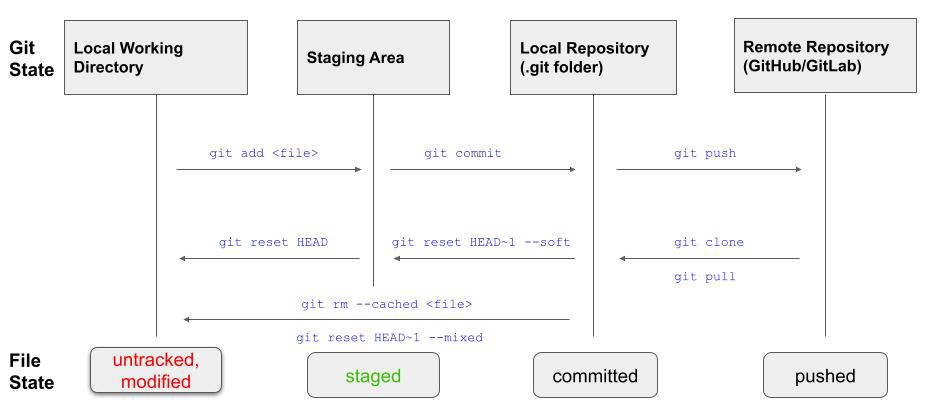

# What a Git?

A crash course on Version Control Systems

---
## What are VCS'es useful for?

- Keeping track of changes to your work
- Collaborating on a project with multiple peers
- Essential part of CI/CD pipelines

---
## Part 1: VCS for versioning your own work

---
### Git file states

  
---
### Let's try it out!

---
## Part 2: VCS for team collaboration

- Working in parallel tracks(branching)
- Remote repositories

---
### Remote repositories

---
### Branching: how does commit log look like

---
### Branching: creating a new branch

---
### Branching: a very simple parallel track workflow

---
### Pull requests: creating a PR

---
### Pull requests: writing a good PR description

---
### Pull requests: reviewing and merging a PR

---
### Pull requests: merge vs squash-merge

---
### Solving merge conflicts

---
### A more complex branching model

---
## Practical tips and tricks
- Annotation
- Cherry-picking
- Rebasing
- Bisecting

---
## Sources
These slides use images and information from following sources

- https://lynn-kwong.medium.com/understand-different-git-states-and-the-corresponding-file-states-fc62348e81d7
- https://www.atlassian.com/git/tutorials/using-branches
- https://gitbookdown.dallasdatascience.com/branching-git-branch.html
- https://myst729.github.io/posts/2019/on-merging-pull-requests/

___