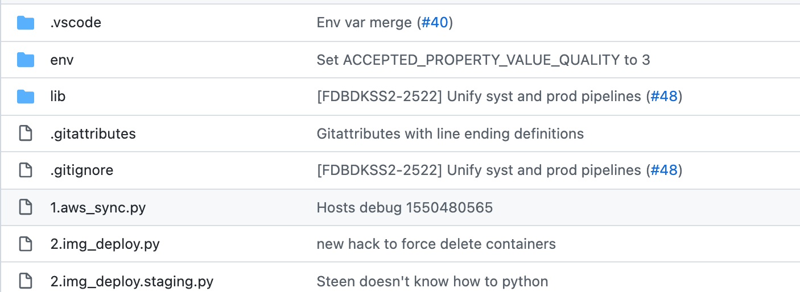

# What a Git?

A crash course on Version Control Systems

---
## What are VCS'es useful for?

- Keeping track of changes to your project
- Rolling back your screw-ups
- Collaborating on a project with multiple peers
- Essential part of CI/CD pipelines (sorry, not today 😅)

---
## Part 1: VCS for versioning your own work

`git init` 😉

---
### Git file states


---

## Git commit
- Represents a single change to a project
- Can contain multiple files
    - `git add filename` OR `git add src/` OR `git add .`
- Has a message describing the changes
    - `git add && git commit`
    - `git commit -am "Fix the login issue"`

---
## Pay attention to the commit message!
- Keep the style consistent - read the commit log
- Provide description about the change - you will thank yourself in the future!
    - [How to write a good Git commit message](https://chris.beams.io/posts/git-commit)


  
---
### Let's try Git live!


---
## Part 2: VCS for team collaboration
- Remote repositories
- Working in parallel tracks(branching)

---
## Remote repositories: Github.com
1. Register
2. Configure Git credentials
    - [Set up an ssh key](https://docs.github.com/en/github/authenticating-to-github/connecting-to-github-with-ssh). Another [tutorial for Windows 10](https://dev.to/bdbch/setting-up-ssh-and-git-on-windows-10-2khk)
    OR
    - [Create an https PAT](https://docs.github.com/en/github/authenticating-to-github/keeping-your-account-and-data-secure/creating-a-personal-access-token) and [store it in credentials manager](https://docs.github.com/en/get-started/getting-started-with-git/caching-your-github-credentials-in-git)
3. [Create a repository](https://docs.github.com/en/github/creating-cloning-and-archiving-repositories/creating-a-repository-on-github/creating-a-new-repository)
4. [Invite collaborators](https://docs.github.com/en/account-and-profile/setting-up-and-managing-your-github-user-account/managing-access-to-your-personal-repositories/inviting-collaborators-to-a-personal-repository)
5. [Clone a repository to your local machine](https://docs.github.com/en/github/creating-cloning-and-archiving-repositories/cloning-a-repository-from-github/cloning-a-repository)
6. Start working!


---
### Branching: commit log

```sh
git log --graph --oneline
```

---
### Branching: creating a new branch

```sh
git branch crazy-experiment
git checkout -b crazy-experiment
```

---
### Branching: a simple parallel track workflow

```sh
git checkout -b new_feature
git commit -am "Restructure login controller"
git commit -am "Add rate limiting for password reset function"
git checkout master 
git merge new_feature # normally done through a PR
```

---
## Pull requests
- Ensure your project code quality is top notch!
- Allow to discuss the best way to solve the issue
- All the project branches should be merged through Pull Requests

---
## Pull requests: creating a PR
- Limit the scope:
    - Avoid redundant style changes
    - Solve one problem per PR only
- Be open to constructive criticism
- [How to create a PR](https://docs.github.com/en/github/collaborating-with-pull-requests/proposing-changes-to-your-work-with-pull-requests/creating-a-pull-request#creating-the-pull-request)

---
## Pull requests: description
- **WHY**: Describe the intent of the PR
- **HOW**: Describe your solution
- Describe any gotchas/quirks you've encountered when working
- Include a link to your issue tracker(e.g. JIRA)
- **Issue/Cause/Solution** is also a nice structure for bugfix PRs
---
## Pull requests: reviewing a PR
- Read description and intention of the PR thoroughly.
- Be polite with your feedback.
- Be pragmatic and constructive - don't argue about minor things.
- Rule of 👍: if you're stuck in argument, go with the PR author's idea, and have a separate forum to discuss underlying disagreements

---
## Pull requests: merging
- Copying your PR description to the merge commit works really nice with `git blame`
- Squash-merging feature branches makes your commit history nice and clean. [Some people might have a different opinion though](https://myst729.github.io/posts/2019/on-merging-pull-requests/) 😉

---
## Solving merge conflicts
- Checkout the feature branch locally (`git checkout feature && git pull`)
- Merge changes from **main** into the feature branch manually: [merge vs rebase](https://www.atlassian.com/git/tutorials/merging-vs-rebasing)
- Fix all the conflicts in your code editor and `git commit` them
- `git push` your changes back to the remote repo (you will need to `--force` push in case of rebase!) 

---
## Other useful git commands
- `git log` shows the change history
- `git blame` shows last change for each code line
- `git stash/git stash pop` temporarily save your changes without commiting them
- `git rebase -i` rewrites commit history. `git push --force` might be needed(use with caution!)
- `git cherry-pick <commit hash>>` applies any commit to your branch
- `git reset <commit hash>` resets your current branch to a specified commit

---
## A more complex branching model


---
## Questions and discussion time
- Recap some topic?
- Something missing?
- Anyone has fun stories to share?
---
## Sources
- https://docs.github.com
- https://lynn-kwong.medium.com/understand-different-git-states-and-the-corresponding-file-states-fc62348e81d7
- https://www.atlassian.com/git/tutorials/using-branches
- https://gitbookdown.dallasdatascience.com/branching-git-branch.html
- https://myst729.github.io/posts/2019/on-merging-pull-requests/
